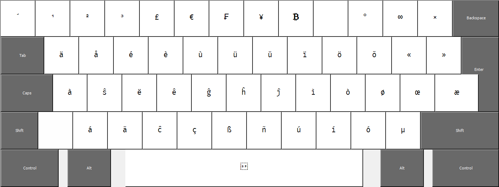
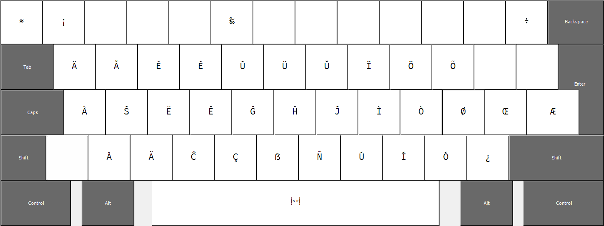

# European Keyboard Layout for Windows

This layout is based on the **US International Layout**, with added diacritics and other special characters accessible via `<Alt Gr>` and **no dead keys**.

---

Contrary to the standard **US International Layout**, which has a few dead keys (apostrophe `'`, double quotes `"`, circumflex `^`, backtick `` ` `` and tilde `~`) to enable typing chraracters such as `éäñ`, this one uses `<Alt Gr>` to access these characters and has **no dead keys**.

It also tries to cover other special characters found in european languages.

**Covered languages** :

- Albanian
- Danish
- Dutch
- English
- French
- German
- Irish
- Italian
- Norwegian
- Portuguese
- Spanish
- Swedish

Feel free to clone this repo and adapt it for your languages!

---

## Accessible with <**Alt Gr**>

## Accessible with <**Shift + Alt Gr**>

---

## How to install

### Using setup

- Download the latest release and run `setup.exe`
- You need to logout and login to see the changes

### Manually

- Download [Microsoft Keyboard Layout Editor (MSKLC)](https://www.microsoft.com/en-us/download/details.aspx?id=102134)
- Open the .klc layout file with MSKLC and select `Project -> Build DLL and Setup Package`, then run the generated `setup.exe`
- You need to logout and login to see the changes

---

## How to uninstall

- Simply run `setup.exe` and select `uninstall`
